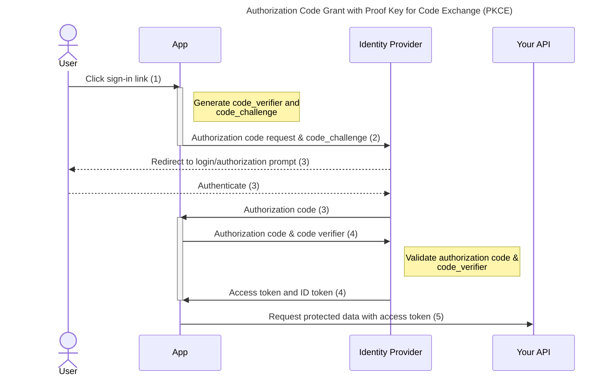

# Authorization Code Grant with Proof Key for Code Exchange (PKCE)

The authorization code protocol is part of OAuth 2.0 (defined in [OAuth 2.0 RFC 7636](https://tools.ietf.org/html/rfc7636)). It involves the exchange of an authorization code for a token. This is the recommended authorization code flow in the [OAuth 2.1 draft](https://datatracker.ietf.org/doc/html/draft-ietf-oauth-v2-1-07#section-10).

## Principle of function

1. The user clicks sign-in within the application.
2. `signinRedirect()` or `signinPopup()` must be used to start the flow.
3. The identity provider authenticates the user and stores the code_challenge and redirects the user back to the application with an authorization code.
4. `signinCallback()` handles this callback by sending this authorization code and code_verifier to the identity provider and receiving in return the access token and ID token.
5. The access token is now accessible via `getUser()?.access_token` and inserted into the requests to your protected API.
