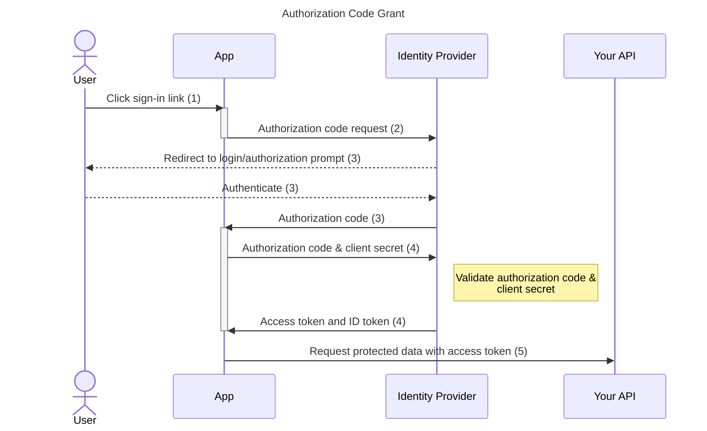

# Authorization Code Grant

The authorization code protocol is part of OAuth 2.0 defined in ([OAuth 2.0 RFC 6749, section 4.1](https://tools.ietf.org/html/rfc6749#section-4.1)). It involves the exchange of an authorization code for a token.

**NOTE** 
It implies some security risks, so you should only use it after a security assessment.

## Security concerns
This flow can only be used for applications, which can protect the client secret:
- **Native app**: Can not securely store the client secret, as it's possible to decompile the application.
- **Single-page app**: Can not securely store the client secret, as the full code is exposed in the user's browser

In that scenarios, [Authorization Code Grant with Proof Key for Code Exchange (PKCE)](authorization-code-grant-with-pkce.md) must be used.

## Principle of function

1. The user clicks sign-in within the application.
2. `signinRedirect()` or `signinPopup()` must be used to start the flow.
3. The identity provider authenticates the user and stores the code_challenge and redirects the user back to the application with an authorization code.
4. `signinCallback()` handles this callback by sending this authorization code and client secret to the identity provider and receiving in return the access token and ID token.
5. The access token is now accessible via `getUser()?.access_token` and inserted into the requests to your protected API.
