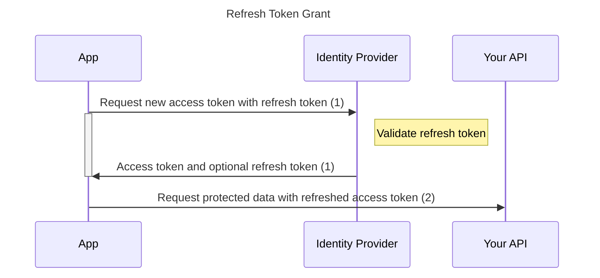

# Refresh Token Grant

This protocol is part of OAuth 2.0 (defined in [OAuth 2.0 RFC 6749, section 1.5](https://tools.ietf.org/html/rfc6749#section-1.5)).
The refresh token grant is used by clients to exchange a refresh token for an access token when the access token has expired.

## Principle of function

1. `signinSilent()` must be used to start the flow.
2. The refreshed access token is now accessible via `getUser()?.access_token` and inserted into the requests to your protected API.
