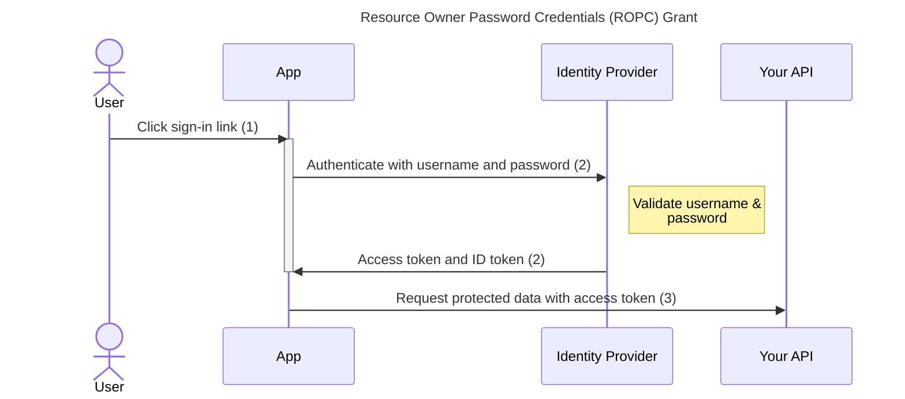

# Resource Owner Password Credentials (ROPC) Grant

This protocol is part of OAuth 2.0 (defined in [OAuth 2.0 RFC 6749, section 4.3](https://www.rfc-editor.org/rfc/rfc6749#section-4.3)).

**NOTE** 
It implies some security risks, so you should only use it after a security assessment.

## Security concerns

To start with, this flow is not part of the [OpenID Connect standard](https://openid.net/specs/openid-connect-core-1_0.html). Furthermore, although it is part of OAuth 2.0, it has been removed in the [OAuth 2.1 draft](https://datatracker.ietf.org/doc/html/draft-ietf-oauth-v2-1-07#section-10), and there are good reasons for this:

* When using this flow, the credentials of the user are exposed to the client application. The RFC mandates that ["the client application MUST discard the credentials once the access token has been obtained"](https://www.rfc-editor.org/rfc/rfc6749#section-4.3.1), but there is no technical way for the Identity Provider / Authorization Server to enforce this point. This flow MUST NOT be allowed unless the Client can be enforced to fulfill this requirement through other means (probably because both are under the same security domain, probably the same organization or similar constraints). This point is covered [several](https://www.rfc-editor.org/rfc/rfc6749#section-1.3.3) [times](https://www.rfc-editor.org/rfc/rfc6749#section-4.3) during the RFC and by some IdP implementations, such as [Auth0](https://auth0.com/docs/get-started/authentication-and-authorization-flow/resource-owner-password-flow) or [Keycloak](https://www.keycloak.org/docs/latest/securing_apps/#_resource_owner_password_credentials_flow), but it is sometimes quickly ignored by some developers.

* Even if the previous point is covered, this flow is increasing the attack surface of the system. For example, if the Client Application is compromised (maybe through an XSS attack, for example), the credentials of the user are exposed, so the attacker have access to other applications accessible by the user. In comparison, for example, in the Authorization Code Flow if the Client Application is equally compromised only the access token is exposed, usually meaning that only the given application has been compromised. A different way to see this is: usually the IdP/Authorization Server are strongly protected, and the Client Applications are allowed lower levels of security auditing... but when using this flow, if any of them is exposed, the user credentials are exposed; so both of them should be equally treated regarding security.

Therefore, this flow MUST NOT be used as a replacement for the Authorization Code flow. This flow can only be seen as a replacement of classic form-based user/password authentication directly in the application.

Then, why are we adding this support in `oidc-client-ts`? Well... form-based user/password authentication is actually widely used in the industry, and using a standard IdP as authenticator for this architecture has some benefits (other things, such as password expiration, user management back-office, etc are provided for free by the IdP). So this flow can be an easy help in this scenario. But you MUST NOT use this flow believing that you are having all the security benefits of OpenID Connect or OAuth; you are not.

## Principle of function

1. The user clicks sign-in within the application.
2. `signinResourceOwnerCredentials()` must be used to start the flow.
3. The access token is now accessible via `getUser()?.access_token` and inserted into the requests to your protected API.
