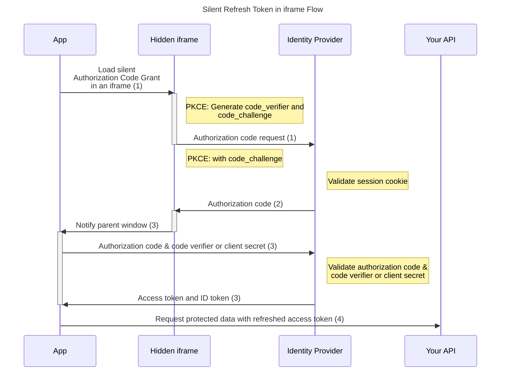

# Silent Refresh Token in iframe Flow

This flow is using the OAuth2.0 [Authorization Code Grant with Proof Key for Code Exchange (PKCE)](https://github.com/authts/oidc-client-ts/blob/main/docs/protocols/authorization-code-grant-with-pkce.md) or [Authorization Code Grant](https://github.com/authts/oidc-client-ts/blob/main/docs/protocols/authorization-code-grant.md) grants.

Difference: To silently refresh the token, the server callback is handled in a hidden iframe and not in the main browsing window.

Running this flow in an iframe succeeds when the user has an authenticated session with the identity provider.
The identity provider is storing a session cookie during the initial authentication. This cookie must be accessible for this flow to work.

## Principle of function

1. `signinSilent()` must be used to start the flow.
2. The identity provider knows the user already by using the session cookie and redirects the user back to the application with an authorization code.
3. `signinCallback()` handles this callback by sending this authorization code and code_verifier (PKCE) or client secret to the identity provider and receiving in return the access token and ID token.
4. The access token is now accessible via `getUser()?.access_token` and inserted into the requests to your protected API.
